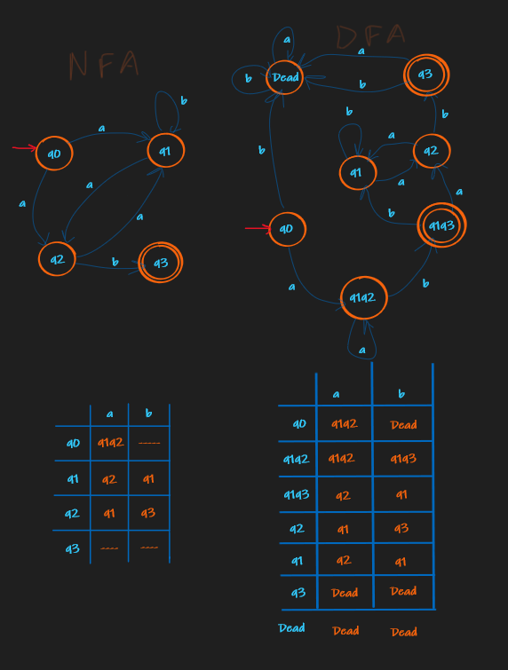

# Theme: NFA to DFA conversion V-4

## Laboratory tasks:

1. Convert NFA from your variant to DFA on paper, writing all transitions and drawing converted automato.



2. Write program which converts nondeterministic finite automato (NFA) to deterministic finite automato (DFA).

```
{
    ('q0', 'a'): ['q1', 'q2'],
    ('q1', 'b'): 'q1',
    ('q1', 'a'): 'q2',
    ('q2', 'a'): 'q1',
    ('q2', 'b'): 'q3',
    ('q1q2', 'a'): ['q1', 'q2'],
    ('q1q2', 'b'): ['q1', 'q3'],
    ('q1q3', 'a'): 'q2',
    ('q1q3', 'b'): 'q1'
}
 ```

3. Display converted automato in form of graph or transition table.

|      |        a |        b |
| ---: | -------: | -------: |
|   q0 | [q1, q2] |     None |
|   q1 |       q2 |       q1 |
|   q2 |       q1 |       q3 |
|   q3 |     None |     None |
| q1q2 | [q1, q2] | [q1, q3] |
| q1q3 |       q2 |       q1 |

For the graph view <a href="./Diagraph.gv.pdf">Diagraph.gv.pdf</a>